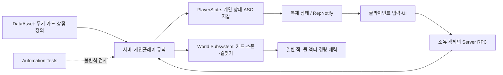

# FPSRoguelite · Gameplay Programming Portfolio

**Unreal Engine로 만드는 1~4인 협동 서바이버 FPS의 구조와 설계**

수많은 적을 상대하는 전투, 실시간 성장, 협동 플레이가 함께 동작하도록 책임과 비용을 나눈 프로젝트입니다. 이 저장소는 프로젝트의 주요 설계 사례를 **문제 → 설계 선택 → 책임과 동작 흐름 → 한계와 검증** 순서로 소개합니다.

`Unreal Engine 5.8` · `C++` · `Gameplay Ability System` · `Server Authority` · `Flow Field` · `Data Assets` · `Automation Tests`

> **읽기용 기술 포트폴리오입니다.** 구조·설계 설명과 다이어그램만 제공합니다. 소스 코드, 코드 발췌, 게임 실행 파일, 구매 에셋은 포함하지 않습니다.

| 설계 과제 | 구현에서 확인할 수 있는 선택 | 상세 설명 |
|---|---|---|
| 많은 적이 같은 플레이어들을 추적할 때 길찾기 비용을 어떻게 공유할까? | 다중 시작점 BFS, 높이를 가진 표면 그래프, 단방향 낙하 링크의 역방향 인접 목록 | [공유 길찾기](docs/02-swarm-pathfinding.md) |
| 인게임 상황에서 상점의 중복 요청·실패·상태 변경을 어떻게 다룰까? | 서버 검증, revision 비교, 재진입 가드, 선차감 후 실패 환불, 소유자에게만 복제 | [상점 거래](docs/03-authoritative-shop.md) |
| 카드가 무기 수치와 행동을 바꿀 때 확장 지점을 어디에 둘까? | DataAsset 정의와 무기 인스턴스 분리, 다형적 카드 효과, 변경 시 캐시 무효화 | [카드·무기 설계](docs/04-card-weapon-design.md) |

## 프로젝트의 설계 전제

- 직접 조준하고 쏘는 1인칭 전투에 서바이버의 성장 루프를 결합합니다.
- 솔로와 최대 4인 협동을 목표로 하며, 판정과 재화 변경은 서버가 맡습니다.
- 일반 적은 경량 체력·풀링·공유 길찾기를 사용하고, GAS는 플레이어·엘리트·보스에 적용하는 범위로 나눕니다.
- 성장 선택은 코인 상점에서 처리합니다. 개인의 구매가 전체 게임을 멈추지 않도록 설계합니다.
- 동시 적 1,000은 **설계상 최악 상한 목표**입니다. 이 저장소는 해당 규모의 FPS나 네트워크 성능 달성을 주장하지 않습니다.

## 구조 한눈에 보기

이 그림은 책임의 개념도입니다. 실제 소유 관계와 호출 관계는 [아키텍처 문서](docs/01-architecture.md)에서 구분합니다.

## 공개 범위와 제작 경계

설명 대상은 FPSR 프로젝트의 프로그래밍 구조와 선택된 구현입니다. Unreal Engine의 GAS·복제 시스템·컨테이너를 직접 제작한 기술로 소개하지 않으며 개발 기간·성능 개선율은 이 문서만으로 확정할 수 없어 수치화하지 않았습니다.

이 저장소는 설계 설명만 공개합니다. [공개 범위 및 권리 고지](NOTICE.md)

---

**English overview:** A documentation-only architecture portfolio for an Unreal Engine cooperative survivor FPS. The case studies cover shared flow-field navigation, class-bucketed enemy pooling, server-authoritative shop transactions, and data-driven card/weapon composition. This repository contains design explanations and diagrams only; no source code or code excerpts are included. [Verification scope](docs/05-verification.md)
