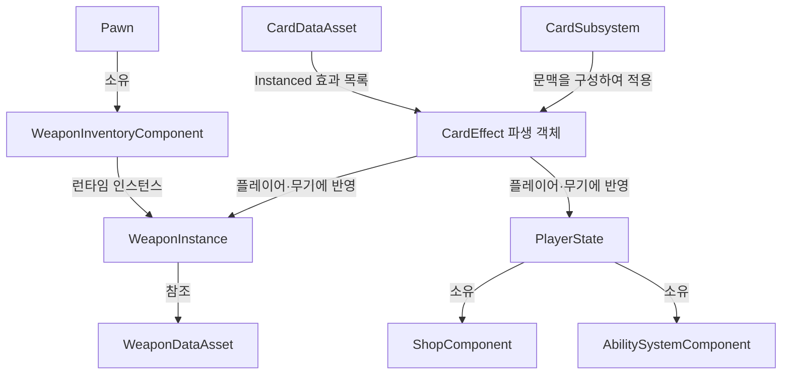

# 책임과 수명주기로 나눈 구조

[← 포트폴리오](../README.md)

이 프로젝트의 핵심은 모든 기능을 한 객체에 넣는 대신, **플레이어 개인 상태·월드의 공용 계산·개별 무기 상태·콘텐츠 정의**를 나누는 데 있습니다. 아래는 현재 코드에서 확인한 경계이며, 전체 프로젝트가 완전히 분리됐다는 평가는 아닙니다.

## 주요 책임

| 계층 | 주요 타입 | 책임과 수명 |
|---|---|---|
| 게임 규칙 | `AFPSRGameMode` | 서버의 런 진행 규칙과 진입 조정 |
| 공유 런 상태 | `AFPSRGameState` | 런 시작 봉인·종료와 공유 상태 |
| 개인 상태 | `AFPSRPlayerState` | ASC, 개인 코인, 획득 카드 기록, 상점 컴포넌트 |
| 개인 거래 | `UFPSRShopComponent` | 상점 세션, 제시 카드, revision, 구매 검증 |
| 무기 상태 | `UFPSRWeaponInstance` | 원본 정의 참조, 탄약·장전·수정치·행동 조각, 계산 캐시 |
| 카드 서비스 | `UFPSRCardSubsystem` | 추첨과 서버의 효과 적용 |
| 적 스폰 | `UFPSREnemySpawnSubsystem` | 풀 취득·반납과 스폰 수 관리 |
| 길찾기 | `UFPSRFlowFieldSubsystem` / `UFPSRFlowFieldComputer` | 월드 연결과 표면 그래프 계산의 분리 |
| 콘텐츠 정의 | 무기·카드·상점 `DataAsset` | 공통 기본값과 저작 데이터 |

`AFPSRPlayerState` 생성자에서 ShopComponent와 ASC를 생성하고, ASC는 복제 및 Mixed 모드로 설정합니다.

## 데이터 정의와 현재 상태를 구분한다

같은 무기 정의를 사용하는 두 플레이어라도 탄약과 업그레이드는 다를 수 있습니다. 따라서 기본 정의를 공유하는 DataAsset과 플레이 중 변경되는 WeaponInstance를 구분합니다. 반대로 같은 카드 효과 로직을 매 플레이어마다 새로 작성할 필요는 없어, 효과는 공유 정의를 읽고 서버가 만든 적용 문맥을 받습니다.

## 서버 판정과 UI의 경계

상점 UI는 구매 의사를 RPC로 전달합니다. 서버는 그 요청이 현재 세션에서 유효한지 판단하고, 카드 적용과 지갑 변경 뒤 Snapshot을 갱신합니다. Snapshot은 소유자에게만 복제되고, `OnRep_Snapshot`은 UI용 이벤트를 발생시킵니다. 호스트는 서버 쪽 `Publish`의 이벤트를 받습니다.

이는 UI가 표시한 가격이나 카드 포인터를 판정의 정본으로 삼지 않기 위한 경계입니다. 서버의 현재 오퍼와 카탈로그가 실제 거래를 결정합니다.

## 일반 적과 GAS의 경계

일반 적은 `AFPSREnemyBase`와 경량 HealthComponent를 중심으로 구성합니다. 적이 많아질수록 반복되는 객체 비용을 줄이려는 선택입니다. 반면 플레이어와 특수 적은 능력·태그·효과를 다루는 GAS의 이점을 활용합니다.

일반 적은 기본적으로 항상 복제 대상으로 간주하도록 설정합니다. 같은 적을 모든 참가자에게 보여 주려는 선택인 동시에, 수가 늘면 복제 비용을 검증해야 하는 지점입니다.

## 모듈과 확장 범위

프로젝트는 Runtime 모듈 `FPSRoguelite`와 Editor 모듈 `FPSRogueliteEditor`를 구분합니다. 런타임은 GAS·EnhancedInput·NetCore·CommonUI·OnlineSubsystem 등을 사용합니다. 에디터의 데이터 검증과 저작 기능은 게임플레이 규칙과 구분되는 영역입니다.

외부 반동 및 1인칭 표현 솔루션의 기능은 이 저장소에서 구현 성과로 주장하지 않습니다. 이 문서는 엔진·외부 솔루션과 프로젝트 코드 사이에서 누가 무엇을 책임지는지 설명합니다.

## 남은 설계 비용

이 분리는 의존성을 없애지는 않습니다. 예를 들어 카드 서비스는 PlayerState, ASC, Inventory를 함께 알아야 하고, 무기 캐시는 전체 무기 수정치가 바뀌어도 무효화돼야 합니다. 타입 수가 늘어나는 비용과 함께, 해당 변경 경로를 테스트하고 유지해야 합니다.
