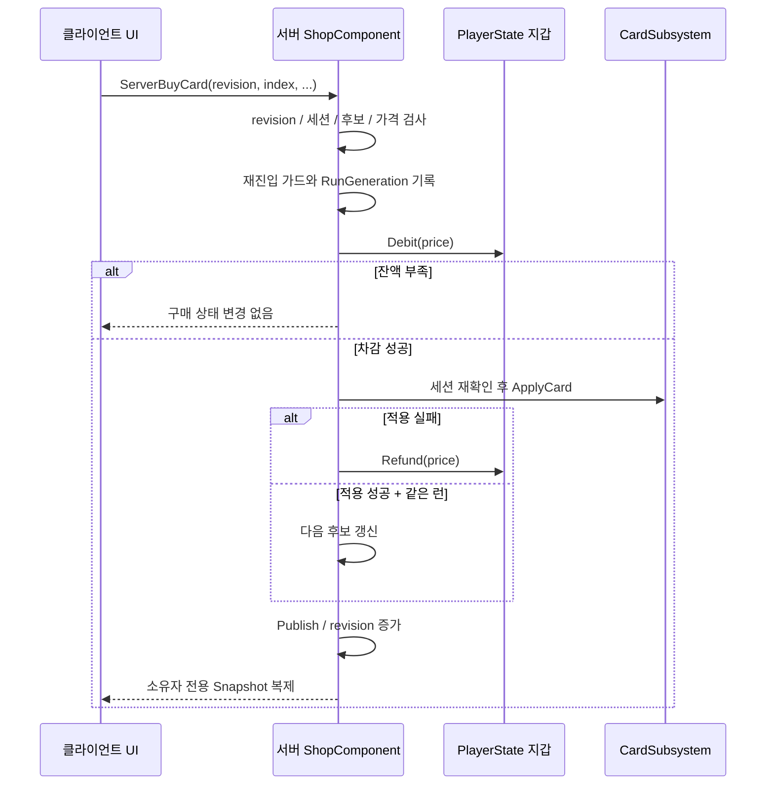

# 사례 02 · 서버 권위의 실시간 상점 거래

[← 포트폴리오](../README.md) · [실제 거래 코드](../samples/shop-transactions.md)

## 문제

게임이 계속 진행되는 동안 플레이어가 카드를 구매합니다. UI를 연 뒤 돈·캐릭터·거리·런 상태가 바뀔 수 있고, 사용자가 같은 버튼을 여러 번 누를 수도 있습니다. 카드 적용이 거부됐는데 돈만 줄어들어서도 안 됩니다.

## 선택: 서버의 오퍼와 revision을 기준으로 요청을 검증한다

클라이언트는 `Revision`, `Index`, 구매 종류와 교체 대상 인덱스를 보냅니다. 가격과 실제 카드 내용은 서버가 가진 Snapshot과 Catalog에서 결정합니다. 클라이언트가 원하는 결과를 직접 확정하지 않습니다.

| 검사 | 코드의 역할 |
|---|---|
| `CanRequest` | 재진입 중인지, revision이 현재 값인지 확인 |
| `IsSessionValid` | 서버 권위, PlayerState와 Controller 관계, 세션 Pawn 동일성, 상호작용 가능 여부 확인 |
| 오퍼 인덱스·가격 확인 | 서버의 현재 후보 목록과 카탈로그에 없는 요청 거부 |
| `TGuardValue<bool>` | 콜백 도중 거래가 다시 들어오는 것을 차단 |
| `RunGeneration` | 실행 중 런 리셋이 일어났는지 구분 |
| `Publish` | revision과 표시용 잔액·가격 갱신, 복제 dirty 표시, 이벤트 발생 |

## 구매 흐름

성공한 구매 뒤 revision이 바뀌므로, 같은 revision을 재전송한 요청은 다시 결제하지 못합니다. 이는 성공 응답을 캐시해 재전송하는 일반적인 결제 idempotency 서비스와는 다르며, **현재 버전과 다른 요청을 거부하는 게임 내 방식**입니다.

## 왜 하나의 Snapshot인가

후보·잔액·가격·revision을 UI가 읽는 구조체로 묶고 `COND_OwnerOnly`로 복제합니다. 다른 플레이어의 개인 오퍼를 모든 클라이언트에 보낼 필요가 없습니다. `OnRep_Snapshot`과 서버의 `Publish`가 같은 변경 이벤트를 사용해 클라이언트와 호스트 화면의 갱신 경로를 제공합니다.

코드에는 Push Model dirty 표시가 있지만, 그 API 사용만으로 모든 빌드에서 Push Model이 활성화됐다는 뜻은 아닙니다. 엔진 빌드 설정과 패키지에서의 실제 동작은 별도 확인 대상입니다.

## 실패와 콜백을 고려한 경계

오퍼의 카드 값은 적용 전에 복사합니다. 효과 적용 중 콜백이 원래 배열을 바꿀 수 있기 때문입니다. 차감 뒤에도 세션과 런 세대를 다시 확인합니다. 효과 적용 실패 시 `Refund`로 보상하고, 성공 뒤 같은 런일 때만 다음 오퍼를 갱신합니다.

이는 게임 스레드의 동기 처리와 효과 계약에 의존합니다. 데이터베이스 트랜잭션이나 모든 부작용을 되돌리는 범용 롤백을 구현한 것은 아닙니다. 특히 카드 효과의 `CanApply` 통과 후 `Apply`가 실패하지 않아야 한다는 계약이 중요합니다.

## 코드로 남긴 검증 항목

[테스트 발췌](../samples/regression-tests.md)에는 정상 구매, 같은 revision 재요청, 위조 인덱스, 실제 효과 적용 거부 후 잔액·오퍼 유지 검사가 있습니다. 서버 테스트 코드를 읽은 근거이며, 패킷 손실·지연을 포함한 실제 다중 클라이언트 검증 결과로 확장해 해석하지 않습니다.
